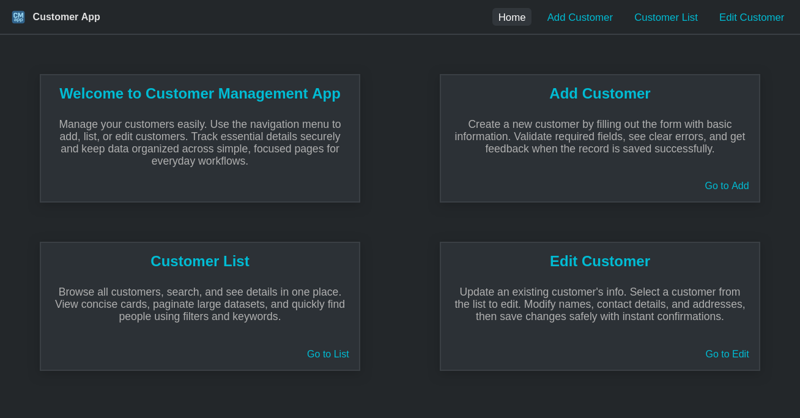

# Customer Management App

Simple full‑stack app to manage customers. The backend is Spring Boot with PostgreSQL and Flyway. The frontend is React (Vite) served by Nginx. You can run everything with Docker Compose.


<small><em>Note: The image above is a screenshot of the frontend application's home page.</em></small>

## Table of Contents

- [What you can do](#what-you-can-do)
- [Quick Demo](#quick-demo)
- [Documentation](#documentation)
- [Tiny Quickstart](#tiny-quickstart)
- [Dev (without Docker)](#dev-without-docker)


## What you can do

- Create, edit, and delete customers
- List customers with pagination and sorting
- Search customers by name, email, phone, or address
- View full customer details
- Try the API in Swagger UI

## Quick Demo

You can try the app online without installing anything:

1. **Start the backend:**
  - Go to https://customer-management-app-morg.onrender.com/ to wake up the backend.
  - Wait for the loading screen to finish (the backend may take up to 1 minute to wake up if it was sleeping).
2. **Open the frontend:**
  - Go to https://facundoberthet.github.io/customer_management_app/
  - Use the app normally. All features are available.

**Tip:** If the backend was sleeping, you may get errors in the frontend until it wakes up. Always open the backend link first and wait for the loading screen to finish before using the frontend.

### Demo Hosting Details

- **Frontend:** Hosted on GitHub Pages ([facundoberthet.github.io/customer_management_app](https://facundoberthet.github.io/customer_management_app/))
- **Backend:** Hosted on Render (free tier, Docker container)
- **Database:** PostgreSQL on Render
- **CI/CD:** GitHub Actions for automated deploys

## Documentation

 - Frontend
   - [Frontend Overview](frontend/README.md)
   - [Frontend Documentation](frontend/docs/)

- Backend
  - [Backend Overview](backend/README.md)
  - [Backend Documentation](backend/docs/)

More pages (setup, API examples, Docker tips, troubleshooting) will be added later.

## Tiny Quickstart

Run the whole stack with Docker:

```bash
docker compose up -d --build
```

Open the app and API:
- Frontend: http://localhost:8081
- Swagger UI (API docs): http://localhost:8080/swagger-ui.html

Stop everything:

```bash
docker compose down
```

## Dev (without Docker)

Requirements: Java 17, Node.js, and a local PostgreSQL server.

1) Backend
- Edit `backend/src/main/resources/application-dev.properties` with your DB name, user, and password.
- Create the database (example: `customerdb`).
- Run the API:

```bash
cd backend
./mvnw spring-boot:run
```

Swagger UI: http://localhost:8080/swagger-ui.html

2) Frontend
- Set API URL in `frontend/.env`:
  - `VITE_API_URL=http://localhost:8080/api`
- Start the dev server:

```bash
cd frontend
npm install
npm run dev
```

App (Vite dev): http://localhost:5173
