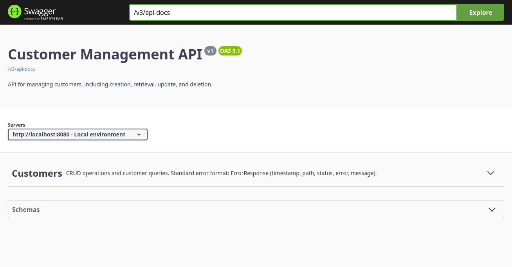

# Backend (Spring Boot + PostgreSQL)

REST API for managing customers. Built with Spring Boot 3, Spring Data JPA, Bean Validation, PostgreSQL, and Flyway. Swagger UI is enabled for exploring and testing the API.



## Table of Contents

- [Quick Guide](#quick-guide)
- [What’s inside](#whats-inside)
- [API overview](#api-overview)
- [Pagination and sorting](#pagination-and-sorting)
- [Error format](#error-format)
- [Database and migrations](#database-and-migrations)
- [Configuration and profiles](#configuration-and-profiles)
- [Health and observability](#health-and-observability)
- [Backend documentation](#backend-documentation)

## Quick Guide

Run locally (dev profile):

```bash
cd backend
./mvnw spring-boot:run
```

- Swagger UI: http://localhost:8080/swagger-ui.html
- Active profile by default: `dev` (see `src/main/resources/application-dev.properties`)

Run with Docker Compose (from the project root):

```bash
docker compose up -d --build app db
```

- API: http://localhost:8080
- Swagger UI: http://localhost:8080/swagger-ui.html

## What’s inside

- Spring Web (REST controllers)
- Spring Data JPA (repository + pagination/sorting)
- Bean Validation (request validation)
- Flyway (SQL migrations)
- Error handler with consistent JSON format

## API overview

Base path: `/api/customers`

- GET `/` — list all customers (small lists; for real use, prefer paging)
- GET `/{id}` — get customer by id
- POST `/` — create customer
- PUT `/{id}` — update customer
- DELETE `/{id}` — delete customer

Pagination and search
- GET `/page` — paged list; query params: `page`, `size`, `sort`
- GET `/search/page` — paged search; params: `q`, `page`, `size`, `sort`

Utility endpoints (optional)
- GET `/by-email?email=...`
- GET `/by-phone?phone=...`
- GET `/exists/email?email=...`
- GET `/count/lastname?lastName=...`
- GET `/stats` — high-level stats

## Pagination and sorting

- `page` starts at 0
- `size` suggested 1..50 (the API caps max size to avoid abuse)
- `sort` is `field,asc|desc` (example: `createdAt,desc` or `lastName,asc`)

Examples:

```bash
curl "http://localhost:8080/api/customers/page?page=0&size=10&sort=createdAt,desc"
curl "http://localhost:8080/api/customers/search/page?q=john&page=0&size=5&sort=lastName,asc"
```

## Error format

On errors, the API returns JSON like:

```json
{
	"timestamp": "2025-08-10T12:34:56",
	"path": "/api/customers/999",
	"status": 404,
	"error": "Not Found",
	"message": "Customer not found with ID: 999"
}
```

Validation errors include field details when possible.

## Database and migrations

- PostgreSQL database
- Flyway runs SQL scripts under `src/main/resources/db/migration`
	- V1: create table and indexes
	- V2: default timestamps and backfill nulls
	- V3: fix `customer.id` sequence default
- In dev, Hibernate uses `ddl-auto=validate` (schema managed by Flyway)

## Configuration and profiles

- Default profile: `dev` (see `application.properties` and `application-dev.properties`)
- Production profile: `prod` (used in Docker)
- Common env vars in Docker Compose:
	- `SPRING_PROFILES_ACTIVE=prod`
	- `DB_URL=jdbc:postgresql://db:5432/customerdb`
	- `DB_USER=appuser`
	- `DB_PASSWORD=apppassword`

Run with another profile locally:

```bash
./mvnw spring-boot:run -Dspring-boot.run.arguments="--spring.profiles.active=prod"
```

## Health and observability

- Actuator (dev):
	- GET http://localhost:8080/actuator/health
	- GET http://localhost:8080/actuator/info
	- GET http://localhost:8080/actuator/metrics

## Backend documentation

- [Overview](docs/01-overview.md)
- [Entities, DTOs, and mappers](docs/02-entities-dtos.md)
- [Controllers and endpoints](docs/03-controllers-endpoints.md)
- [Pagination, search, and sorting](docs/04-pagination-search-sorting.md)
- [Error handling](docs/05-error-handling.md)
- [Database and migrations](docs/06-database-migrations.md)
- [Configuration and profiles](docs/07-configuration-profiles.md)
- [Testing](docs/08-testing.md)
- [Troubleshooting](docs/09-troubleshooting.md)
