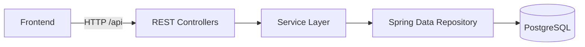

# Overview

This backend is a REST API built with Spring Boot 3, Spring Data JPA, and PostgreSQL. It exposes CRUD endpoints for customers, with pagination, search, sorting, validation, and consistent error responses. Flyway manages the database schema.

## High‑level architecture

Key ideas
- Controllers handle HTTP and map requests/responses.
- Services hold business logic (validation beyond annotations, rules, orchestration).
- Repositories handle persistence using Spring Data JPA.
- Entities represent the database model; migrations are applied with Flyway.

## Project layout (backend)

Common packages you will find under `com.example.customer_management_app`:

- `controller` – REST endpoints (request/response objects, parameter parsing)
- `service` – business logic, transactions, coordination
- `repository` – Spring Data JPA repositories
- `model` or `entity` – JPA entities (e.g., `Customer`)
- `config` – Spring configuration (OpenAPI, profiles, etc.)
- `dto` (if present) – request/response DTOs separate from entities
- `exception` (if present) – error types and global handlers

Note: Names can vary slightly in this codebase, but the roles are the same.

## Data flow (request → response)

1) Client calls an endpoint like `GET /api/customers/page`.
2) Controller reads query params (page, size, sort, q) and delegates to the service.
3) Service builds the query using the repository (with paging/sorting or search).
4) Repository talks to PostgreSQL via JPA/Hibernate.
5) Service returns results; controller maps them to a response (page metadata + items).

## Database and migrations

- PostgreSQL is the database.
- Flyway applies SQL scripts on startup (see `src/main/resources/db/migration`).
- Hibernate DDL is set to `validate` in dev; schema changes come from Flyway.
- Migrations include: table creation, default timestamps, and sequence fixes.

More details: [Database and migrations](06-database-migrations.md)

## Pagination, search, and sorting

- Server‑side pagination with `page` (0‑based) and `size`.
- Sorting with `sort=field,asc|desc` (e.g., `createdAt,desc`).
- Text search endpoint filters by name, last name, email, phone, or address.

More details: [Pagination, search, and sorting](04-pagination-search-sorting.md)

## Validation and errors

- Bean Validation on inputs (e.g., required fields, formats).
- Consistent JSON error format with timestamp, path, status, error, message.

More details: [Error handling](05-error-handling.md)

## Configuration and profiles

- Default profile is `dev` (local development).
- Docker uses `prod` profile and environment variables for DB connection.
- Swagger UI is available at `/swagger-ui.html`.

More details: [Configuration and profiles](07-configuration-profiles.md)

## Controllers and endpoints

Main resource: `Customer` under `/api/customers`.

- CRUD: `GET /{id}`, `POST /`, `PUT /{id}`, `DELETE /`
- Paged list: `GET /page`
- Paged search: `GET /search/page`
- Utility: `/by-email`, `/by-phone`, `/exists/email`, `/count/lastname`, `/stats`

More details: [Controllers and endpoints](03-controllers-endpoints.md)

## Testing

- Maven tests run with Spring Boot test starter.
- Tests can roll back DB changes per test using transactions.

More details: [Testing](08-testing.md)

## How to run

- Quick local run and Docker instructions are in the main backend README: [backend/README.md](../README.md)

