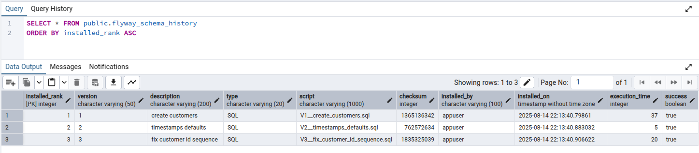

# Database and Migrations (Flyway + PostgreSQL)

This backend uses Flyway to version-control the PostgreSQL schema. On application startup, Flyway scans `classpath:db/migration` for SQL files named `V{version}__{description}.sql` and applies any pending migrations in order, recording each run in the `flyway_schema_history` table. JPA/Hibernate is configured to validate the schema, not to create or update it.

- Database: PostgreSQL
- Schema management: Flyway (SQL-based, forward-only)
- Location: `src/main/resources/db/migration`
- Profiles: `dev` and `prod` both enable Flyway; `dev` uses `baseline-on-migrate=true` to adopt existing schemas.
- JPA: `spring.jpa.hibernate.ddl-auto=validate` so Hibernate verifies tables/columns match the entities.

## Current schema at a glance

Table: `customer`

- Columns
	- `id BIGSERIAL PRIMARY KEY`
	- `first_name VARCHAR(40) NOT NULL`
	- `last_name VARCHAR(40) NOT NULL`
	- `email VARCHAR(255) NOT NULL` (unique)
	- `phone VARCHAR(15)` (optional)
	- `address VARCHAR(100)` (optional)
	- `created_at TIMESTAMP` (default `NOW()`; backfilled for old nulls)
	- `updated_at TIMESTAMP` (default `NOW()`; backfilled for old nulls)

- Indexes
	- `ux_customer_email` unique index on `email` (enforces uniqueness and speeds up lookups)
	- `ix_customer_first_name_lower` functional index on `LOWER(first_name)` (for case-insensitive search)
	- `ix_customer_last_name_lower` functional index on `LOWER(last_name)` (for case-insensitive search)
	- `ix_customer_phone` index on `phone`

Notes
- Functional indexes with `LOWER(...)` are used so case-insensitive queries can hit an index.
- Timestamps get database defaults (even if rows are inserted outside the application).
- ID generation uses a sequence (see V3) to guarantee auto-increment behavior across environments.

## Migrations walkthrough

The following migrations exist today. Each file is idempotent where practical (using `IF NOT EXISTS`) and safe to run once in order.

### V1 — create table and baseline indexes
File: `V1__create_customers.sql`

What it does
- Creates the `customer` table with main columns and a `BIGSERIAL` primary key.
- Adds a unique index on `email`.
- Adds supporting indexes for name searches and phone lookups.

Highlights (abridged)
```sql
CREATE TABLE IF NOT EXISTS customer (
		id BIGSERIAL PRIMARY KEY,
		first_name VARCHAR(40) NOT NULL,
		last_name VARCHAR(40) NOT NULL,
		email VARCHAR(255) NOT NULL,
		phone VARCHAR(15),
		address VARCHAR(100),
		created_at TIMESTAMP,
		updated_at TIMESTAMP
);
CREATE UNIQUE INDEX IF NOT EXISTS ux_customer_email ON customer (email);
CREATE INDEX IF NOT EXISTS ix_customer_first_name_lower ON customer (LOWER(first_name));
CREATE INDEX IF NOT EXISTS ix_customer_last_name_lower ON customer (LOWER(last_name));
CREATE INDEX IF NOT EXISTS ix_customer_phone ON customer (phone);
```

Design intent
- Keep timestamps nullable initially; set sane defaults in V2 to support legacy/imported data.
- Use functional indexes for predictable performance on case-insensitive queries.

### V2 — timestamp defaults and backfill
File: `V2__timestamps_defaults.sql`

What it does
- Sets `DEFAULT NOW()` on `created_at` and `updated_at` so new rows get timestamps even if inserted outside the app.
- Backfills any existing `NULL` timestamps with `NOW()` to remove inconsistencies.

Highlights (abridged)
```sql
ALTER TABLE customer ALTER COLUMN created_at SET DEFAULT NOW();
ALTER TABLE customer ALTER COLUMN updated_at SET DEFAULT NOW();
UPDATE customer
SET created_at = COALESCE(created_at, NOW()),
		updated_at = COALESCE(updated_at, NOW());
```

Design intent
- Avoid enforcing `NOT NULL` at the database level for timestamps to remain flexible for imports.
- Keep application-level timestamps in the entity as well; DB defaults act as a safety net.

### V3 — ensure ID sequence default and reseed safely
File: `V3__fix_customer_id_sequence.sql`

What it does
- Creates an explicit sequence `customer_id_seq` if it does not exist.
- Sets `customer.id` default to `nextval('customer_id_seq')` and makes the sequence `OWNED BY` the column.
- Reseeds the sequence using `setval` to the current maximum `id` so the next insert doesn’t conflict.

Highlights (abridged)
```sql
CREATE SEQUENCE IF NOT EXISTS customer_id_seq START WITH 1 INCREMENT BY 1;
ALTER TABLE customer ALTER COLUMN id SET DEFAULT nextval('customer_id_seq');
ALTER SEQUENCE customer_id_seq OWNED BY customer.id;
SELECT setval(
	'customer_id_seq',
	COALESCE((SELECT MAX(id) FROM customer), 1),
	(SELECT COUNT(*) > 0 FROM customer)
);
```

Design intent
- Some environments lose the implicit default created by `BIGSERIAL` (for example, after certain dumps/restores). This migration standardizes the default and reseeds defensively.
- The third argument to `setval` sets the `is_called` flag: if the table has rows, the next `nextval` returns `MAX(id)+1`; otherwise it starts from `1`.


<small><em>Note: This image shows the pgAdmin result grid for the flyway_schema_history table, listing each applied migration (V1, V2, V3) with columns installed_rank, version, description, type, script, checksum, installed_by, installed_on, execution_time, and success (all marked true).</em></small>

## Spring configuration (how this runs)

- `spring.flyway.enabled=true` in both `dev` and `prod` profiles.
- `spring.flyway.baseline-on-migrate=true` in `dev` so Flyway can adopt an existing local schema as a starting point.
- `spring.jpa.hibernate.ddl-auto=validate` in all profiles to prevent Hibernate from changing the schema; Flyway is the source of truth.
- Properties files
	- `application.properties`: common settings (Swagger UI, active profile default to `dev`).
	- `application-dev.properties`: local DB URL/credentials, Flyway baseline, logging, Actuator exposure.
	- `application-prod.properties`: DB from environment variables, Flyway enabled, no baseline.

## Adding your own migration

1) Decide the change you need (e.g., add a column, new index, new table).
2) Create a new SQL file with the next version number under `src/main/resources/db/migration`.
	 - Naming: `V4__add_status_to_customer.sql` (note the double underscore `__`).
3) Write the SQL. Prefer forward-only changes; avoid editing past migration files (Flyway tracks checksums).
4) Start the application (locally or via Docker). Flyway will apply pending migrations automatically at startup.

Tips
- Prefer `IF NOT EXISTS`/`IF EXISTS` for idempotence when safe.
- Avoid destructive changes in production. Instead, create additive migrations and then follow up with cleanups.
- Test locally with a fresh database to ensure the full chain (V1 → latest) works.

## Troubleshooting and operations

- “Relation already exists” or “duplicate object”
	- Likely the database was created manually before V1. In `dev`, `baseline-on-migrate=true` helps; otherwise inspect `flyway_schema_history` and align.
- “Checksum mismatch” in Flyway
	- A past migration file changed. Restore the original file or create a new versioned migration to adjust the schema. Avoid editing old files.
- Email uniqueness violations on import
	- The unique index on `email` enforces no duplicates. Clean the data or handle conflicts in your import scripts.
- Sequence out of sync (duplicate key value violates unique constraint on `id`)
	- Re-run a `setval` to bump the sequence:
		```sql
		SELECT setval('customer_id_seq', (SELECT COALESCE(MAX(id), 1) FROM customer), (SELECT COUNT(*) > 0 FROM customer));
		```
- Cleaning dev database (dangerous)
	- Flyway can drop all objects with `flyway.clean` (disabled by default). Never use in production.

## Appendix: why these indexes?

- Unique index on `email`: guarantees uniqueness and enables fast lookups by email.
- Functional indexes on `LOWER(first_name)` and `LOWER(last_name)`: support case-insensitive search without full scans. Ensure queries also use `LOWER(...)` to benefit.
- Index on `phone`: speeds up exact-match lookups and filters.

That’s the complete picture of the database layer and how it evolves safely with Flyway in this project.
