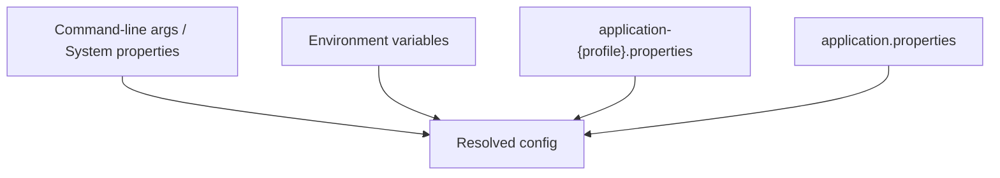
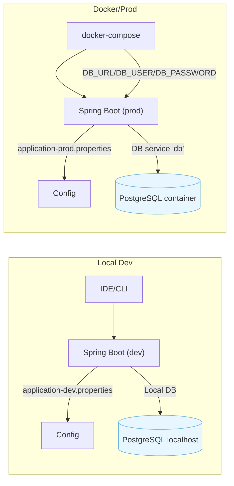

# Configuration and Profiles

This page explains how configuration is organized and how Spring profiles are used in this backend. It also shows where to plug environment variables (locally and in Docker) and what changes across `dev` and `prod`.

## Profiles used

- dev (default locally)
	- DataSource points to your local PostgreSQL.
	- Flyway baseline-on-migrate=true (can adopt existing schema).
- prod (Docker/Deployment)
	- DataSource taken from environment variables.
	- Flyway enabled (no baseline).

Where the properties live
- `src/main/resources/application.properties` → common defaults; sets `spring.profiles.active=dev`.
- `src/main/resources/application-dev.properties` → overrides for dev.
- `src/main/resources/application-prod.properties` → overrides for prod.

## How Spring resolves configuration

Order of precedence (simplified):
1) Command line args and system properties.
2) Environment variables (SPRING_PROFILES_ACTIVE, DB_URL, etc.).
3) `application-{profile}.properties` (active profile).
4) `application.properties` (common).

Diagram of resolution flow



## Activating profiles

Default (local): `dev` is active because `application.properties` sets:

```properties
spring.profiles.active=dev
```

Ways to switch profile
- CLI (local):

```bash
./mvnw spring-boot:run -Dspring-boot.run.arguments="--spring.profiles.active=prod"
```

- Env variable (local/Docker):

```bash
export SPRING_PROFILES_ACTIVE=prod
```

- Docker Compose (recommended for prod profile): set `SPRING_PROFILES_ACTIVE=prod` in the service env.

## What changes per profile

Database
- dev: defined in `application-dev.properties`
	- `spring.datasource.url=jdbc:postgresql://localhost:5432/customerdb`
	- `spring.datasource.username=facu`
	- `spring.datasource.password=facudb`
- prod: defined by env vars in `application-prod.properties`
	- `spring.datasource.url=${DB_URL}`
	- `spring.datasource.username=${DB_USER}`
	- `spring.datasource.password=${DB_PASSWORD}`

Schema management
- Flyway enabled in both profiles.
- dev: `spring.flyway.baseline-on-migrate=true`.
- prod: baseline is not enabled; assume an empty or already versioned database.
- JPA in both: `spring.jpa.hibernate.ddl-auto=validate` (Hibernate does not create/update the schema).

Actuator (minimal observability)
- Exposed in dev: `health`, `info`, `metrics` (see `application-dev.properties`).
- Note: In Spring Boot 3 there is no `/actuator/flyway`; use logs or the `flyway_schema_history` table to see migrations.

Swagger/OpenAPI
- Common configuration in `application.properties` (path: `/swagger-ui.html`).

## Environment diagrams (profiles and Docker)



## Good practices

- Do not commit credentials; use environment variables in prod.
- Keep `ddl-auto=validate` and delegate schema changes to Flyway.
- Avoid editing already-applied migrations; create new versions instead.
- In dev, `baseline-on-migrate=true` helps adopt existing schemas.
