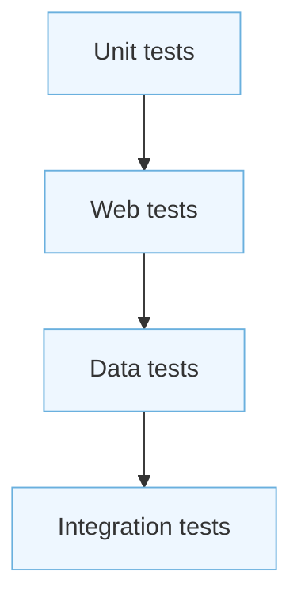
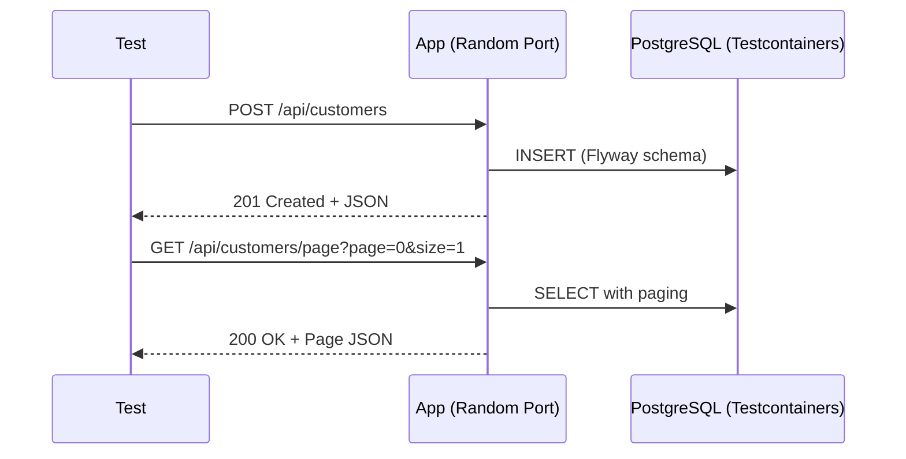

# Testing

This page explains how to test the backend: which kinds of tests, how to run them, and practical setups for web, service, and data layers. It also shows options for using H2 or PostgreSQL (via Testcontainers) and how Flyway fits in.

## Goals

- Fast feedback for business logic and mappings (unit tests).
- High confidence in web endpoints (HTTP, validation, error format).
- Realistic data layer checks (repositories, pagination/search) with PostgreSQL.
- Reproducible builds locally and in CI.

## Test types and tools

- Unit tests
	- JUnit 5 + AssertJ
	- Mockito (mock collaborators in services/mappers)
- Web layer tests
	- `@WebMvcTest` + `MockMvc` for controllers in isolation
- Data layer tests
	- `@DataJpaTest` for repositories and JPA mapping
	- DB options: H2 (fast) or PostgreSQL via Testcontainers (most realistic)
	- Flyway: disable for H2 or run migrations for PostgreSQL
- Integration tests (end-to-end within the app)
	- `@SpringBootTest` (start the full context)
	- Testcontainers PostgreSQL + Flyway migrations



## How to run

- All tests (CLI):

```bash
cd backend
./mvnw test
```

- Focus a single test class (CLI):

```bash
./mvnw -Dtest=CustomerServiceImplTest test
```

- From IDE: run test classes/packages via the test runner (green/red bar feedback).

Artifacts
- Text and XML reports in `backend/target/surefire-reports/`.
- If using coverage, view it in the IDE or CI add-ons.

## Web layer tests

When to use
- Validate request/response contracts, HTTP status codes, validation errors, and error format.

Typical setup
- `@WebMvcTest(controllers = CustomerController.class)`
- `MockMvc` injected
- Mock service layer with `@MockBean`
- Validate JSON using JSONPath or direct string matching

What to assert
- 2xx for valid requests, 4xx/5xx paths handled by `GlobalExceptionHandler`
- Validation errors include field messages
- ErrorResponse shape (timestamp, path, status, error, message)

## Service unit tests

When to use
- Business logic without web or DB overhead (fastest feedback).

Typical setup
- Plain JUnit 5 + Mockito
- Instantiate service with mocked repository
- Verify interactions and edge cases (nulls, duplicates, exceptions)

## Data layer tests (JPA)

Two realistic options:

1) H2 (fast, but mind SQL differences)
- `@DataJpaTest`
- Disable Flyway for these tests (PostgreSQL-specific migrations will fail on H2):
	- `@TestPropertySource(properties = "spring.flyway.enabled=false")`
- Let Boot create the schema from entities for the test slice (default for `@DataJpaTest`)

2) PostgreSQL with Testcontainers (recommended for repository logic that depends on PostgreSQL specifics)
- `@DataJpaTest`
- Use Testcontainers to spin up a real PostgreSQL and run Flyway migrations
- Wire properties dynamically:

```java
@Testcontainers
@DataJpaTest
class CustomerRepositoryTest {
	@Container
	static PostgreSQLContainer<?> pg = new PostgreSQLContainer<>("postgres:16");

	@DynamicPropertySource
	static void dbProps(DynamicPropertyRegistry r) {
		r.add("spring.datasource.url", pg::getJdbcUrl);
		r.add("spring.datasource.username", pg::getUsername);
		r.add("spring.datasource.password", pg::getPassword);
		r.add("spring.flyway.enabled", () -> "true");
	}

	// ... tests
}
```

Notes
- Flyway will apply your SQL migrations against the container.
- This setup needs Docker running (Docker Desktop on your machine).

## Integration tests (`@SpringBootTest`)

When to use
- Validate the whole app wiring: controllers, services, repositories, error handling, and Flyway.

Typical setup
- `@SpringBootTest(webEnvironment = SpringBootTest.WebEnvironment.RANDOM_PORT)`
- Testcontainers PostgreSQL + Flyway (same approach as above)
- Use `TestRestTemplate` or `WebTestClient` to call HTTP endpoints

Asserts to include
- Full happy-path flows (create → get → update → delete)
- Pagination and search behavior
- Validation/error scenarios (email duplicate → 409, not found → 404)



## Test data strategies

- Builders/test factories: create valid Customer objects with minimal noise.
- `@Sql` scripts to seed data before tests.
- Reusable JSON payloads for controller tests.
- Keep fixtures small and focused; avoid shared mutable state across tests.

