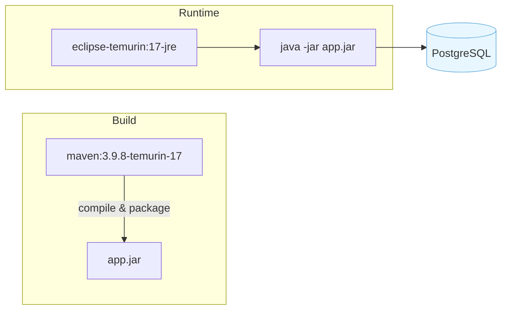
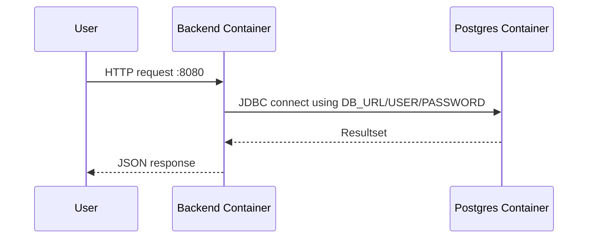

# Backend Dockerfile + Compose explained

This guide focuses on the backend container: how the Dockerfile works and how it integrates with `docker-compose.yml`.

## Overview diagram



## backend/Dockerfile (multi-stage) — line by line

1) Base image for building
- `FROM maven:3.9.8-eclipse-temurin-17 AS builder`
	- Uses Maven with JDK 17 to compile the app.

2) Working directory
- `WORKDIR /workspace`
	- All subsequent paths are relative to `/workspace`.

3) Copy build descriptor and warm the cache
- `COPY pom.xml ./`
- `RUN mvn -q -DskipTests dependency:go-offline`
	- Downloads dependencies without compiling; speeds up later builds when only source changes.

4) Copy sources and build
- `COPY src ./src`
- `RUN mvn -q -DskipTests package`
	- Compiles and packages the JAR to `target/customer_management_app-0.0.1-SNAPSHOT.jar`.

5) Runtime stage with slim JRE
- `FROM eclipse-temurin:17-jre`
	- Lightweight JRE for running the app.

6) Non-root user
- `RUN useradd -ms /bin/bash appuser` then `USER appuser`
	- Security best practice: avoid running as root in containers.

7) Working dir and JAR copy
- `WORKDIR /app`
- `COPY --from=builder /workspace/target/customer_management_app-0.0.1-SNAPSHOT.jar /app/app.jar`
	- Copies the built JAR from the builder stage to the runtime image.
	- Note: if you change project version, update this path or use a copy pattern.

8) Expose port
- `EXPOSE 8080`
	- Documents the port; Compose maps it to the host.

9) Environment defaults
- `ENV SPRING_PROFILES_ACTIVE=prod JAVA_OPTS=""`
	- Default to `prod` in containers (Compose overrides with env if needed).

10) Entrypoint
- `ENTRYPOINT ["sh", "-c", "java $JAVA_OPTS -jar /app/app.jar"]`
	- Uses `JAVA_OPTS` if provided (heap sizes, GC flags, etc.).

## docker-compose.yml — backend and DB

We focus on `db` and `app` services as they power the backend.

Service: db (PostgreSQL 16)
- `image: postgres:16` — official image.
- `environment:`
	- `POSTGRES_DB`, `POSTGRES_USER`, `POSTGRES_PASSWORD` — initial database and credentials.
- `ports: "5433:5432"` — host 5433 to avoid colliding with a local Postgres on 5432.
- `volumes: db_data:/var/lib/postgresql/data` — persistent data across container restarts.
- `healthcheck` — waits until DB is ready using `pg_isready`.

Service: app (backend)
- `build: { context: ./backend, dockerfile: Dockerfile }` — builds from the backend Dockerfile.
- `environment:` maps DB credentials to Spring Boot via profile `prod`:
	- `SPRING_PROFILES_ACTIVE=prod` — activates `application-prod.properties`.
	- `DB_URL=jdbc:postgresql://db:5432/customerdb` — hostname `db` resolves to the DB service.
	- `DB_USER=appuser`, `DB_PASSWORD=apppassword` — injected into Spring config.
	- `JAVA_OPTS` — optional JVM tuning.
- `ports: "8080:8080"` — expose API on host.
- `depends_on: db: condition: service_healthy` — start app only when DB is ready.

How env vars reach Spring
- In `application-prod.properties` the datasource properties read `${DB_URL}`, `${DB_USER}`, `${DB_PASSWORD}`.
- Flyway runs on startup and applies migrations against the DB.

## End-to-end picture



## Common commands

Build and start only DB + backend (from repo root):

```bash
docker compose up -d --build db app
```

Rebuild backend after code changes and restart container:

```bash
docker compose build app && docker compose up -d app
```

Follow backend logs:

```bash
docker compose logs -f app
```

Exec into the backend container (shell):

```bash
docker compose exec app sh
```

Stop and remove containers (keep volume):

```bash
docker compose down
```

Remove containers + volume (danger: deletes DB data):

```bash
docker compose down -v
```

List volumes:

```bash
docker volume ls
```
