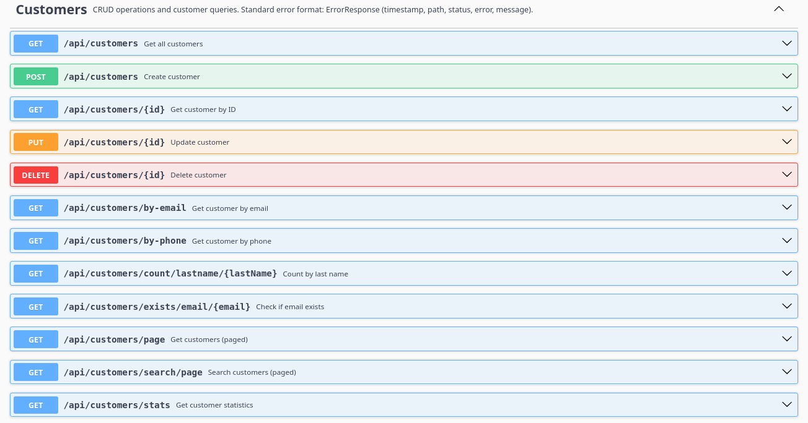
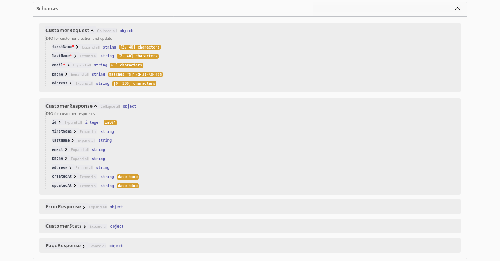

# Backend Docs

Detailed documentation for the Spring Boot API will be organized here.

## Using Swagger 

What you can do
- Explore all endpoints grouped by tag (customers, etc.).
- See request/response models and required fields.
- Try requests directly from the browser.
- Inspect response status codes and payloads.

How to use it
1) Open Swagger UI: `http://localhost:8080/swagger-ui.html` (Docker/dev).
2) Expand an endpoint, click “Try it out”.
3) Fill parameters/body (e.g., page/size/sort or a JSON for create/update).
4) Press “Execute” to send a real request.
5) Check the server response, status code, and example curl shown by Swagger.

Quick examples
- Paged list: GET `/api/customers/page` with `page=0`, `size=5`, `sort=id,desc`.
- Search: GET `/api/customers/search/page` with `q=john`, `page=0`, `size=10`.
- Create: POST `/api/customers` with JSON body (firstName, lastName, email, ...).
- Get by id: GET `/api/customers/{id}`.
- Update: PUT `/api/customers/{id}` with JSON body (full object).
- Delete: DELETE `/api/customers/{id}`.

## Schemas in Swagger

The “Schemas” section shows the data models the API uses. It’s generated from your code annotations (`@Schema`, Bean Validation) and helps you see required fields and examples.

For example, the `Customer` schema includes:
- id (read-only), firstName, lastName, email, phone, address, createdAt (read-only), updatedAt (read-only)
- Examples set via `@Schema(example=...)`
- Validation hints like required fields (`@NotBlank`) or patterns for phone

How to use it
1) Scroll to the bottom of Swagger UI and open “Schemas”.
2) Click `Customer` to view fields, types, and example values.
3) Use the schema to craft request bodies for POST/PUT.

