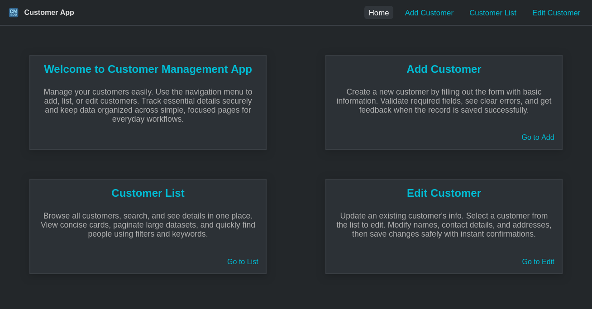

# Frontend (React + Vite)

Single-page app built with React and Vite. It talks to the backend API and is served in production by Nginx (with `/api` proxy).



## Table of Contents

- [Quick Guide](#quick-guide)
- [What’s inside](#whats-inside)
- [Dev setup](#dev-setup)
- [API base URL](#api-base-url)
- [Docker and Nginx](#docker-and-nginx)
- [Frontend documentation](#frontend-documentation)

## Quick Guide

Run locally (Vite dev server):

```bash
cd frontend
npm ci
npm run dev
```

- App: http://localhost:5173
- Configure API URL via `.env` (see below)

Run in Docker (from project root):

```bash
docker compose up -d --build front app db
```

- Frontend: http://localhost:8081
- API (proxied by Nginx via /api): http://localhost:8081/api → http://localhost:8080

## What’s inside

- React + Vite
- Router (SPA)
- Simple API client using `fetch` or axios
- Environment-based API base URL
- Nginx reverse proxy for `/api` in production

## Dev setup

- Node 20 recommended
- Install deps: `npm ci`
- Start dev server: `npm run dev`
- Env file: `.env` (copied from `.env.example` if you have one)

## API base URL

- In dev, set `VITE_API_URL` in `.env` to point to your backend, for example:

```
VITE_API_URL=http://localhost:8080
```

- In Docker production, the frontend is built with `VITE_API_URL=/api` and Nginx proxies `/api` to `app:8080`.

## Docker and Nginx

- Multi-stage Dockerfile builds the static site and serves it via Nginx.
- Nginx config (`frontend/nginx/default.conf`) proxies `/api` to the backend container.
- See detailed docs below for the file-by-file explanation.

## Frontend documentation

- [Overview](docs/01-overview.md)
- [Dev Setup](docs/02-dev-setup.md)
- [API Integration](docs/03-api-integration.md)
- [Routing and Pages](docs/04-routing-pages.md)
- [Styling and UI](docs/05-styling-ui.md)
- [Docker and Nginx](docs/06-docker-nginx.md)
- [Troubleshooting](docs/07-troubleshooting.md)
- [Testing](docs/08-testing.md)
