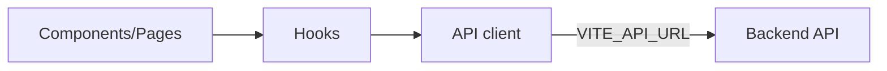

# Overview

This page gives a high-level picture of the React app: tech stack, folder layout, and how it talks to the backend.

## Tech stack

- React + Vite
- React Router (SPA)
- Fetch/axios for API calls
- CSS (or your chosen styling solution)
- Nginx in production (Docker)

## Data flow (simplified)

## API integration

- Base URL: `VITE_API_URL` from `.env` during dev; `/api` in Docker behind Nginx.
- Handle errors consistently; show toast/messages on validation errors.
- Pagination/search handled by backend; frontend passes query params.

