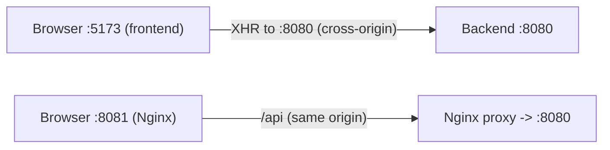

# Dev Setup

How to run the React app locally, configure environment variables, and connect to the backend.

## Requirements

- Node.js 20.x (LTS)
- npm 10+
- Backend running locally on http://localhost:8080 (or adjust the API URL)

## Install and run

```bash
cd frontend
npm ci
npm run dev
```

- Vite dev server: http://localhost:5173
- Hot Module Replacement (HMR) enabled by default

## Environment variables

- Create a `.env` file in `frontend/` to override defaults during development.
- Important: Vite only exposes variables prefixed with `VITE_` to the client.

Common variables

```
VITE_API_URL=http://localhost:8080
```

Usage in code

```ts
const API_BASE = import.meta.env.VITE_API_URL ?? '/api';
```

## Talking to the backend

- In dev, the frontend calls the backend directly at `VITE_API_URL`.
- In Docker production, `VITE_API_URL` is set to `/api` and Nginx proxies to `app:8080`.

## Linting and formatting

Scripts (from `package.json`):

```bash
npm run lint      # ESLint (JS/TS, React, hooks)
npm run build     # Vite production build
npm run preview   # Preview the built app locally
```

## Ports and CORS

- Frontend dev server: 5173
- Backend dev: 8080
- If you hit CORS issues in dev, ensure the backend allows `http://localhost:5173` or use a simple proxy in Vite.

### What is CORS?

- CORS (Cross-Origin Resource Sharing) is a browser security policy that restricts JS calls from one origin to another.
- An origin is scheme + host + port. Example: `http://localhost:5173` (frontend dev) calling `http://localhost:8080` (backend) is cross-origin.
- The browser enforces CORS via response headers (e.g., `Access-Control-Allow-Origin`) and sometimes a preflight `OPTIONS` request.

How we handle it here
- Dev: either enable CORS in the backend for `http://localhost:5173`, or use Vite’s dev proxy to make calls appear same-origin.
- Docker/prod: Nginx serves the frontend and proxies `/api` to the backend, so the browser sees a single origin (`http://localhost:8081`), and CORS is not triggered.

Quick diagram



Common errors (and meaning)
- No 'Access-Control-Allow-Origin': backend didn’t allow your origin.
- CORS preflight channel did not succeed: the `OPTIONS` preflight failed (check backend/proxy for `OPTIONS`).
- Blocked by CORS policy: general message; inspect Network tab for request/response headers.

Optional Vite dev proxy (if needed)

```ts
// vite.config.ts
export default defineConfig({
	server: {
		proxy: {
			'/api': 'http://localhost:8080'
		}
	}
})
```

