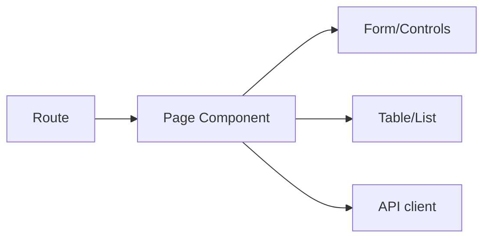

# Routing and Pages

Overview of the SPA routing and the main page components.

## Router overview

- The app is a Single-Page Application. Nginx serves `index.html` for any unknown path so client-side routing works on refresh.
- Typical routes (based on components under `src/`):

```
/                  → Home.jsx
/customers         → CustomerList.jsx (list + paging/search)
/customers/new     → AddCustomer.jsx + CustomerForm.jsx
/customers/:id     → CustomerDetails.jsx
/customers/:id/edit→ EditCustomer.jsx + CustomerForm.jsx
```

## Pages and responsibilities

- Home.jsx: landing page, quick links.
- CustomerList.jsx: paginated table, search and sort controls.
- CustomerDetails.jsx: read-only view with fields.
- AddCustomer.jsx / EditCustomer.jsx: wrappers for create/update flows.
- CustomerForm.jsx: controlled form, validation, submit to API.
- EditSearch.jsx: helper UI to refine search/sort inputs.

## Data flow


