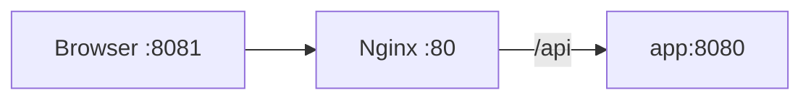

# Docker and Nginx

How the frontend image is built (multi-stage) and how Nginx serves the SPA and proxies `/api` to the backend.

## Dockerfile (multi-stage)

Stage 1: build
- `FROM node:20-alpine AS builder`
- Install deps with `npm ci` (deterministic)
- `ENV VITE_API_URL=/api` so production build uses relative base
- `npm run build` → outputs to `dist/`

Stage 2: runtime
- `FROM nginx:alpine`
- Copy Nginx config: `nginx/default.conf`
- Copy static files: `dist` → `/usr/share/nginx/html`
- Expose port 80

## Nginx config (proxy + SPA fallback)

`frontend/nginx/default.conf`:

```nginx
server {
	listen 80;
	root /usr/share/nginx/html;
	index index.html;

	location ~* \.(js|css|png|jpg|jpeg|gif|svg|ico)$ {
		try_files $uri =404;
		expires 7d;
		add_header Cache-Control "public, max-age=604800, immutable";
	}

	location /api/ {
		proxy_pass http://app:8080/api/;
		proxy_set_header Host $host;
		proxy_set_header X-Real-IP $remote_addr;
		proxy_set_header X-Forwarded-For $proxy_add_x_forwarded_for;
		proxy_set_header X-Forwarded-Proto $scheme;
	}

	location / {
		try_files $uri /index.html;
	}
}
```

How it works
- The SPA is served from `/usr/share/nginx/html`.
- Any `/api/...` request is forwarded to the backend service named `app` on port 8080.
- Any other path falls back to `index.html` so client-side routes work on refresh.

## Compose integration

- `front` depends on `app` in `docker-compose.yml`.
- Host port 8081 is mapped to container port 80.
- With `VITE_API_URL=/api` baked into the build, the frontend calls `/api/...` and Nginx proxies it to the backend.


